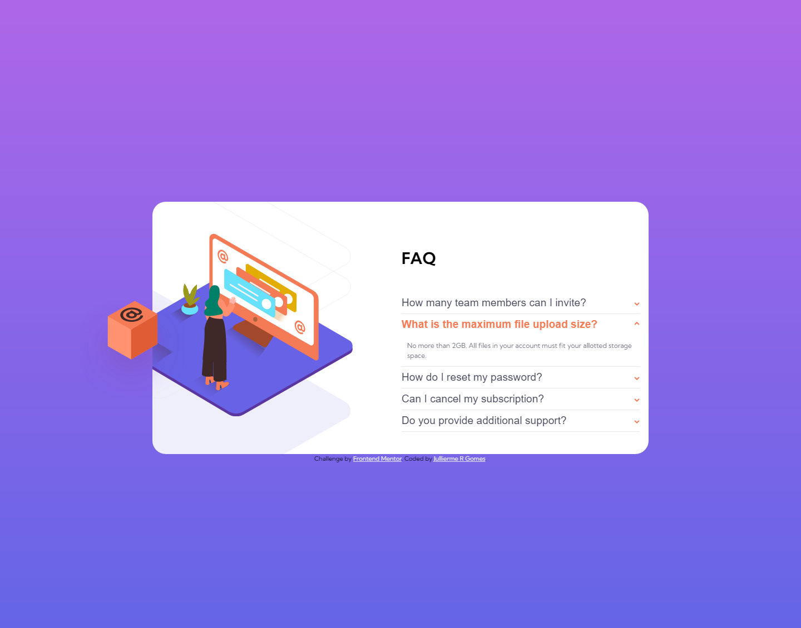

# Frontend Mentor - FAQ accordion card solution

This is a solution to the [FAQ accordion card challenge on Frontend Mentor](https://www.frontendmentor.io/challenges/faq-accordion-card-XlyjD0Oam). Frontend Mentor challenges help you improve your coding skills by building realistic projects. 

## Table of contents

- [Overview](#overview)
  - [The challenge](#the-challenge)
  - [Screenshot](#screenshot)
  - [Links](#links)
- [My process](#my-process)
  - [Built with](#built-with)
  - [What I learned](#what-i-learned)
  - [Continued development](#continued-development)
  - [Useful resources](#useful-resources)
- [Author](#author)
- [Acknowledgments](#acknowledgments)

## Overview

### The challenge

Your users should be able to: 

- View the optimal layout for the component depending on their device's screen size
- See hover states for all interactive elements on the page
- Hide/Show the answer to a question when the question is clicked

### Screenshot

### Links

- Solution URL: [https://github.com/jullierme-r/faq-card](https://github.com/jullierme-r/faq-card)
- Live Site URL: [https://jullierme-r.github.io/faq-card/](https://jullierme-r.github.io/faq-card/)

### Built with

- Semantic HTML5 markup
- CSS custom properties
- Flexbox
- Position
- Media Queries
- Mobile-first workflow
- JavaScript

## Author

- GitHub - [jullierme-r](https://github.com/jullierme-r)
- Frontend Mentor - [@jullierme-r](https://www.frontendmentor.io/profile/jullierme-r)
